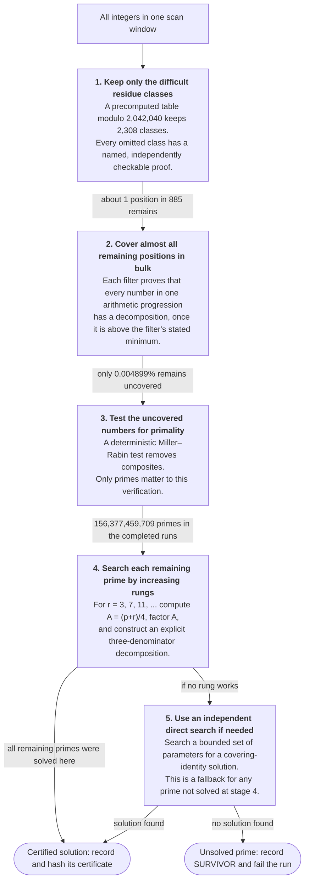

# Erdős–Straus census and verification sieve

The Erdős–Straus problem asks whether every integer `n ≥ 2` admits a decomposition

```
4/n = 1/x + 1/y + 1/z.
```

This repository approaches the problem in two different ways. The first is a
**classified census**. For every prime in the difficult residue classes below 10¹⁵,
it records how far a standard search must go and which local obstruction explains
each failed step. The purpose is to study the difficult cases, not simply to decide
whether a solution exists.

The second is a **verification sieve**. Here the question is more direct: can every
prime in a large interval be given a certified decomposition? The completed run covers
the primes from 255,255 up to

```
18,446,744,065,119,614,976  = 1.8446744065 × 10¹⁹
```

Primes below 255,255 are covered by the smaller censuses. The upper endpoint is
slightly below 2⁶⁴ because the direct-search fallback needs some arithmetic headroom.
For this reason we do **not** claim the full 64-bit range: the last 8,589,936,640
integers below 2⁶⁴ are outside this computation. See the
[complete run report](docs/sieve/RUN_REPORT.md) for the exact scope and audit trail.

## The classification

For `4/p = 1/A + 1/B + 1/C` with `A = (p+r)/4`, rung `r` fails when no divisor of
`q² = (pA)²` lands in the class `−q (mod r)`. Each failed rung gets the finest
certificate that explains it:

| level | certificate |
|---|---|
| **J** | the Jacobi symbol `(·/r)` blocks the class |
| **RC** | some other real character mod `r` blocks it, Jacobi does not |
| **S** | no real character does, but `−q` lies outside the multiplicative support subgroup `H` |
| **R** | residual: no local certificate at all |

Below 10¹⁵ (hard class, 932,642,160,749 primes, 557,964,077,963 failed rungs):
**99.1773 % J**, 386,596 RC, 43,257 S, **0.8227 % R**; maximum search depth **155**
at p = 172,538,390,619,841. Every level-S failure occurs at rung 51 — and the released code proves this is forced: since `4A = p + r`, the
support subgroup always contains 4, which confines level S to an explicit finite set
of rungs (`51, 119, 123, 187, 195, 219, 255` below the scanner's cap), of which only
51 is reachable below rung 63. `python3 census/es_levels.py` derives the set from scratch.

## Layout

The repository holds **two products that share almost nothing**: the *census*, which
classifies every hard-class prime, and the *sieve*, which verifies that every prime in a
range is solvable. They enumerate the same family from opposite ends and cannot
substitute for one another.

| path | what |
|---|---|
| `census/` | **the classification.** `rung_scan.cpp` is the reference scanner — self-testing, unchanged since it produced the published census. `rung_scan2.cpp` is the optimized CPU scanner, **2.34× the reference**, output-identical by `tests/diff2.sh`. Plus `run8.sh` (shard harness), `merge.py`, `verify_cert.py`, `analyze_census.py`, `es_levels.py`. |
| `sieve/` | **the verification.** `cover_scan.cpp` is the frozen reference; `rung_scan3.cpp` the optimized scanner, agreeing with it byte for byte via `tests/diff3.sh`. `verify_covers.py` is the independent exact-arithmetic oracle; `prune_filters.py` selects the published filter set. |
| `census/cuda/` | CUDA port of the census (~9 ns/prime on one NVIDIA L4; ~90× one CPU core) — [census/cuda/README.md](census/cuda/README.md) documents the architecture. |
| `sieve/cuda/` | CUDA port of the verification sieve — the port that produced the 10¹⁹ runs. A different bottleneck from the census port: marking is 99% of device time and the host tail is the lever, so no constant carries between the two. |
| `tables/` | the sieve's certified artifacts: `class_table_120120.txt` and `class_table_2042040.txt` (surviving classes plus a named killing certificate for every other unit class), and `filters/` (pruned filter sets). |
| `data/` | census output and run records. `c15/` is the 10¹⁵ census — `MERGED.txt`, `interesting.txt` (585,677 certificates, all re-verified in exact arithmetic), `ANALYSIS.txt`; `c13/` is the 10¹³ census, same layout; `c_10^k/` are lower heights. `c19/` and `c64/` hold the 460 shard records of the 10¹⁹ runs, and `rederive/` the re-derivation evidence for them. |
| `docs/` | `census/` (runbook, reproduction, cost model), `sieve/` (the completed 10¹⁹ run report, `WHEEL.md`, `SCALING_COVER.md`), `gpu/`, and `design/` (the design specs the sources reference). |
| `tools/` | `run19.sh` (the restartable shard driver that produced the 10¹⁹ runs), `Dockerfile`, `docker-entrypoint.sh`. |
| `tests/` | the differential gates and the stage-D profiling harness. |
| `Makefile` | builds every scanner at the repo root, where the tests and runbooks expect them. |
| `CHANGES.md` | release history of the public distribution, so a downloaded snapshot can say which release it is. |

## How the verification sieve works

The sieve is organized as a funnel. At first, inexpensive arguments handle enormous
groups of integers at once. The numbers which remain pass to the next stage, where a
more specific and somewhat more expensive test is made. Only a very small fraction
reach the one-at-a-time searches near the bottom.

The diagram follows one window of integers through this procedure. A number is never
silently thrown away. It leaves the funnel only when it is shown to be composite or
when an algebraic certificate proves that it is solvable.

The first two stages rest on one covering identity. For positive integers
`a, c, d, k` with `ck > a`, put `m = 4acd − 1`, `e = ck − a`; then every integer
`p ≡ −4a²d (mod m)` with `p ≥ p_min(a,c,d)` satisfies `p + k = 4ade` and

```
4/p = 1/(ade) + 1/(acdp) + 1/(cdep)
```

so one triple `(a, c, d)` certifies an **entire arithmetic progression** at once —
the family is self-certifying, and no per-prime certificate is ever emitted for it.



### What each stage means

**1. Keep only the difficult residue classes.** This first reduction is called the
*wheel*. It contains 2,308 residue classes modulo 2,042,040. An ordinary prime wheel
skips a class because its members have a small factor. This wheel is different: it
skips a class because a stored certificate proves that every sufficiently large
integer in the class has a decomposition. At startup the program derives the wheel
again and compares it with the checked-in table. It will not run if the two disagree.
The derivation and four independent checks are given in
[WHEEL.md](docs/sieve/WHEEL.md).

**2. Cover arithmetic progressions.** The wheel cannot represent every useful
congruence, so 3,745 additional filters are applied to each scan window. Each filter
contains a modulus, a residue, and a minimum value from which the proof is valid. One
algebraic identity then proves every number in that progression. Across the two
completed runs, these bulk arguments reduced 20,849,290,563,502,911 wheel positions to
1,021,313,896,705 numbers requiring a primality test: **99.995101%** of the wheel
positions were already certified in bulk.

**3. Separate primes from composites.** The remaining positions are tested with a
deterministic Miller–Rabin test for 64-bit integers. Of the 1,021,313,896,705 numbers
tested, 864,936,436,996 were composite. It is sufficient to solve the problem for
primes: a decomposition for a prime factor can be scaled to one for the composite
integer. Thus, only the primes continue to the next stage.

**4. Construct a certificate for each remaining prime.** For each of the
156,377,459,709 primes left by stage 3, the program tries the allowed values
`r = 3, 7, 11, ...` in increasing order. At each value it sets `A = (p+r)/4`, factors
`A`, and searches its divisors for a witness. That witness gives the three denominators
in the original equation. We call this the *rung walk* because each new value of `r`
is the next rung of the search. Every prime in both completed runs was solved here.

**5. Fall back to a direct search.** If the rung walk were ever exhausted, the program
would search directly for a second kind of algebraic certificate. No prime in the
completed range needed this fallback. If both searches failed, the program would emit
a `SURVIVOR` record and the run would fail; the final survivor count was zero.

There are two algebraic certificate families behind the five stages. In the source
they are abbreviated **F1** and **F2**. F1 is the covering identity written above. It
can prove a whole arithmetic progression at once, or it can be used directly for one
prime. F2 is the uniform rung certificate. It can prove a fixed residue class, or give
the rung witness for one particular prime.

Both families are necessary. Every F1 modulus is congruent to 3 modulo 4, so F1 alone
cannot distinguish all residue classes modulo 8. F2 supplies the missing information.
Together they prove that only primes congruent to 1 modulo 24 need to enter the
expensive part of the sieve. This reduction is derived and checked by the repository;
it is not taken as an external assumption.

For readers following the implementation, the same idea appears at different scales.
At stage 1 a certificate can settle a whole residue class. At stage 2 it can settle a
progression within one of the retained classes. At stages 4 and 5 it settles one prime.
The divisibility checks written in the source as `m | M` and `L | M` determine whether
a certificate is valid for an entire wheel class. A certificate that fails that check
may still be valid for a narrower progression, but applying it to the whole class would
be incorrect.

Measured end to end over `[255255, 18446744065119614976)`: 20.849 quadrillion wheel
positions, 99.995101% certified by bulk covers, and 156,377,459,709 primes passed to
the rung walk. Every one was solved there; the direct fallback was never needed and
**survivors = 0**. The 460 shard records tile the interval without gaps, reconcile all
stage counts, and commit to each deterministic certificate stream by SHA-256. Selected
shards were reproduced byte for byte, 719,775 sampled certificates were re-derived in
exact arithmetic, and two additional windows containing 8,293,033 certificates were
checked exhaustively. What these checks establish, and what they do not, is recorded in the
[run report](docs/sieve/RUN_REPORT.md#7-how-this-was-verified).

The smaller `M = 120120` wheel (220 lanes) is retained alongside: it is the one the
differential gates run at, and `make check-diff3` exercises both moduli.

## Reproduce

```sh
make && make check               # MUST print SELF-TEST PASSED — per machine, per flag set
./census/run8.sh 0 1000000000000 # 0 → 10^12 on 8 cores, ~25 min
python3 census/verify_cert.py census_out/interesting.txt
```

`make check` recomputes the entire *p* < 10⁵ census against an independent
Python/SymPy-derived reference: all four level counts, the full depth histogram, the
max depth, and the exact list of the 20 residual failures.

The verification sieve has its own gates, and they are the stronger ones:

```sh
make check-cover   # the frozen reference end to end: every certificate re-derived
                   # in exact rationals, zero survivors
make check-diff3   # the optimized scanner against that reference -- identical SUMMARY
                   # and identical sorted certificate set, at two wheel moduli
```

Both scanners derive the certified class table themselves at startup and refuse to run
if it disagrees with the checked-in artifact in `tables/`; `sieve/verify_covers.py`
regenerates the same table independently in exact arithmetic.

The CUDA scanner (`census/cuda/`, needs CUDA 12.x, `sm_89+`) produces byte-identical
statistics and an identical certificate set, enforced by `make -C census/cuda check`, which
diffs it against the CPU reference end-to-end and cross-checks every kernel against
an independent implementation (Miller–Rabin for the sieve, Pollard rho for the
factorizer, the reference's own `test_rung` for the classifier).

## Output format

One line per record, whitespace-separated:

```
SUMMARY lo=.. hi=.. primes=.. jac=.. rc=.. sup=.. res=.. escalated=.. pairpath=.. maxr=.. maxr_p=.. hist=r:n,r:n,...
REALCHAR p A r      # level-RC failure at rung r
SUPPORT  p A r      # level-S failure — must satisfy the four-constraint, verified
RESIDUAL p A r      # level-R failure (only with --emit-residual)
DEEP     p A r      # prime whose first hit is at rung r >= threshold
SAMPLE   p A r      # spot-check sample of first hits
```

Emission order is unspecified; `census/merge.py` sorts. The emitted *set* is deterministic
and bit-identical across machines, thread counts, window sizes, and the CPU/CUDA
implementations.

## Citing

Paper: *Local Obstructions and Slowly Growing Search Depth in the Erdős–Straus
Conjecture: A Classified Census to 10¹³* (working draft; see the data-availability
section for the correspondence between the paper's tables and these files).
