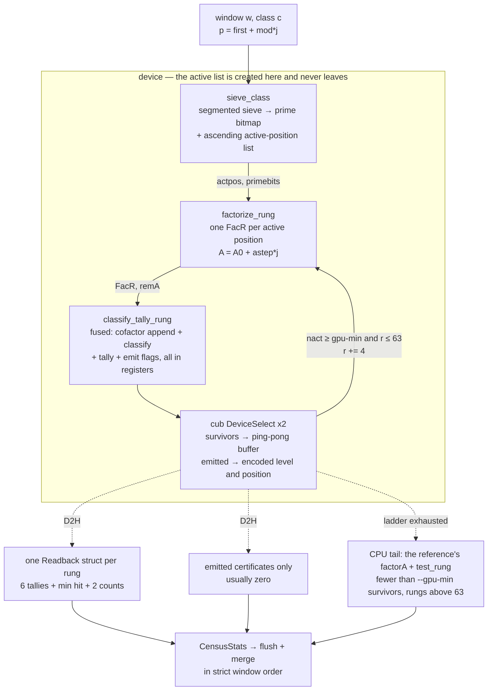
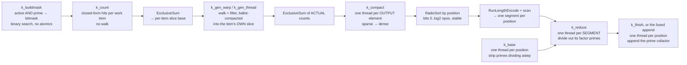
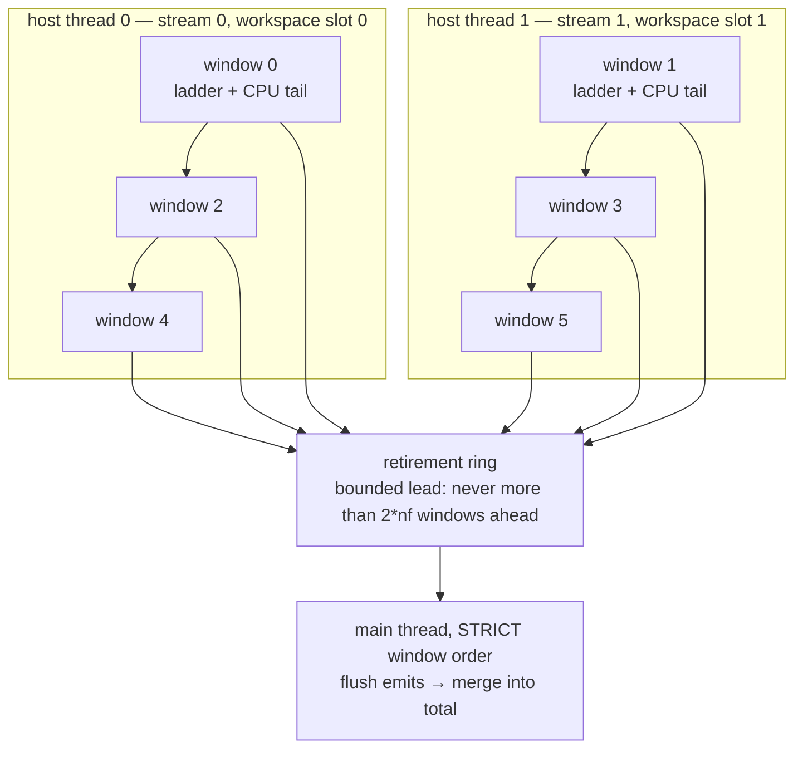

# The CUDA port — architecture, and why it is shaped this way

This directory is a GPU implementation of the rung scanner in `../rung_scan.cpp`. It
exists for one reason: the census is *classification*, its only value is statistical,
and statistics need height. On one NVIDIA L4 this runs at **~9 ns/prime**, against
**545 ns/prime** for the CPU reference on 12 threads of the same box — which turns the
10¹⁵ hard-class census from a day-and-a-half of a 24-vCPU machine into ~3.6 hours of one
mid-range GPU.

The constraint that shapes every decision below is that going faster is not allowed to
change the answer:

> The CUDA scanner must produce a **byte-identical `SUMMARY`** and a **byte-identical
> sorted certificate set** against `rung_scan.cpp`, on every range, in both population
> modes. `make check` enforces it; a census produced by a binary that has not passed
> that gate on *that* machine does not count.

`rung_scan.cpp` itself is never touched — not edited, not optimized, not "just given a
flag". It is the thing everything else is diffed against, and it is only worth that if
it stays unchanged. This port reuses it by `#include`-ing it into one translation unit
with `main` renamed (`ref_host.cpp`), so the reference's own `factorA`, `test_rung`,
`is_prime` and prime tables are callable here with zero modification and zero
duplication. That is also what makes the checks meaningful: the oracle is the live
reference, not numbers copied out of it.

```sh
make            # nvcc, sm_89 + sm_90
make check      # THE GATE. Must be green on this machine before any census.
make gate       # the factorization GO/NO-GO measurement alone

./rung_scan_cuda LO HI --hard840 --spanlog 24 --rmax 255 --emit-deep 71
bash run_gpu.sh 0 1000000000000000 400 c15      # sharded, resumable, gate-first
```

---

## 1. The computation, and why it suits a GPU badly at first glance

For a prime `p`, rung `r ≡ 3 (mod 4)` is tested by forming `A = (p+r)/4` and asking
whether any divisor of `q² = (pA)²` lands in the residue class `−q (mod r)`. If none
does, the rung fails and gets the finest certificate that explains it (J, RC, S, R —
see `../README.md`); the prime then climbs to `r+4`. Almost every prime hits at `r = 3`;
the interesting events live in a very thin, very deep tail.

Three properties drive the design:

- **The work is a ladder, not a map.** The active set shrinks by ~100× per few rungs.
  A design that pays a fixed per-rung cost dies in the tail; a design that pays per
  active position dies at rung 3.
- **The expensive step is factoring `A`, not classifying it.** But `A` runs over an
  arithmetic progression, so a whole window can be factored by *sieving* — one strided
  walk per factor prime — instead of factoring each `A` on its own. That is the
  reference's trick and it is worth three orders of magnitude; the port keeps it.
- **The population is a wheel.** Primes are enumerated as 6 residue classes mod 840
  (`--hard840`) or 1 class mod 24. Within a class, `p = first + mod·j` and
  `A = A0 + astep·j`, so a *position index* `j` determines everything. Nothing but `j`
  ever needs to move.

The unit of work is therefore a **window**: `SPAN = mod << spanlog` of the integer line,
processed one residue class at a time, one rung at a time.

### One window, end to end

Everything inside the dashed box stays in device memory for the whole ladder. The host
receives **one struct per rung**, plus the handful of certificates actually emitted.



The two exits from the ladder are the whole design in miniature: the rung loop stays on
the device while the work is wide, and hands over to the CPU reference exactly when it
gets narrow — or when it reaches a rung the device is not allowed to classify.

---

## 2. Module map

| file | role |
|---|---|
| `rung_scan_cuda.cu` | CLI. Argument parsing mirrors the reference exactly; anything unsupported (`--occupancy`) is delegated wholesale rather than half-implemented |
| `ref_host.{cpp,h}` | the reference, included once, exposed through narrow accessors. The only TU allowed to `#include "../rung_scan.cpp"` (a second include would ODR-violate) |
| `tables.cu/.cuh` | device tables: factor primes + inverses, sieve base primes + inverses, and the per-rung Jacobi/Legendre lookup tables |
| `sieve.cu/.cuh` | segmented primality sieve → prime bitmap + ascending active-position list, on device |
| `factorize.cu/.cuh` | the count → scan → generate → compact → sort → segment → reduce pipeline that factors every active `A` of a window at one rung |
| `classify.cu/.cuh` | the certificate classifier (device twin of `test_rung`), plus the fused census kernel |
| `facr_append.cuh` | the one shared inline the two classifier paths must agree on |
| `census.cu/.cuh` | the rung ladder, double-buffered windows, statistics, CPU handoff |
| `gate.cu` | the GO/NO-GO harness: correctness first, then timing |
| `tests/` | `diff_range.sh` (the primary test), the level-S certificate replay corpus, the height sweep |

---

## 3. The five decisions that define the port

### 3.1 The active list is created on the device and never leaves it

The sieve writes both a prime bitmap and an ascending list of active positions into
device memory. From there through the entire rung ladder — factorize, classify, tally,
compact — **nothing per-position crosses PCIe.** Per rung the host receives exactly one
`Readback` struct (level tallies + two compaction counts, in a single transfer) and,
only when something is actually emitted, the handful of encoded certificate positions.

This arrived in two deliberate steps. Task 5 first did the bookkeeping *on the host*, so
the statistics were literally the reference's own `record_hit`/`record_fail` code and
could not drift from it — correctness bought first. Profiling then put that host loop at
**47.8% of runtime**, which is what justified moving it to the device. The same
discipline appears throughout: the numbers came before the optimization, every time.

Two smaller consequences worth naming, because both were measured:

- Reading the two `DeviceSelect` counts separately from the tallies cost **15.8% of
  runtime** — four latency-bound round trips where two would do. Hence one struct.
- Survivors compact into a ping-pong buffer and stay resident. The earlier code
  round-tripped the survivor list to the host every single rung.

### 3.2 Determinism is structural, not something the tests hope for

The output must be bit-identical across machines, thread counts, window sizes, and
implementations. That is achieved by construction, not by checking afterwards:

- **Allocation never uses atomics.** Every stage is *count → exclusive prefix sum →
  write into your own slice*. Every write lands at an index that is a pure function of
  the inputs, so there is no order to depend on.
- **Atomics are allowed only where the value is order-invariant** — the per-rung tallies
  are integer sums and a `min`. Block scheduling cannot change a sum.
- **Compaction is stable** (`cub::DeviceSelect::Flagged`), and the radix sort is stable,
  so equal positions keep their input order — which is ascending work-item index, hence
  ascending prime index. The *contents and the order* of every segment are a pure
  function of the inputs.
- **The sieve's composite marking writes a constant `0`**, so it is idempotent:
  overlapping progressions need no coordination and no atomics, and concurrent marks
  cannot disagree.
- **Concurrency never crosses a window.** Double buffering runs two windows at once, but
  each window computes exactly what it would have computed alone, and the main thread
  folds, flushes and merges strictly in window order — preserving emission order and the
  order-sensitive `maxr_p` tie-break.

Emission order *across* windows is not promised (it never was — `merge.py` sorts). The
emitted **set** is.

### 3.3 Factorization: keep the reference's algorithm, change only the memory discipline

The reference factors a whole window with one strided walk per factor prime: for `l ∤
astep`, `l | A_j` exactly when `j ≡ −A0·astep⁻¹ (mod l)`, so the hits form an arithmetic
progression in `j`. It then scatter-updates a per-position `Fac` in place — which on a
GPU means atomics, or worse, a race.

The port keeps the algorithm and replaces the scatter with allocate-then-fill:

| stage | kernel / call | note |
|---|---|---|
| 1. count | `k_count` | closed-form hit count per work item — no walk, no atomics |
| 2. scan | `cub::DeviceScan::ExclusiveSum` | per-item slice base |
| 3. generate | `k_gen_warp`, `k_gen_thread` | walk + filter, each item writes only into its own slice |
| 3b. compact | scan of *actual* counts + `k_compact` | sparse → dense |
| 4. sort | `cub::DeviceRadixSort::SortPairs` | by position |
| 4b. segment | `DeviceRunLengthEncode` + scan | one segment per position with ≥1 hit |
| 4c. reduce | `k_base`, `k_reduce`, `k_finish` | divide out the factors |



Read left to right, the invariant is the same at every arrow: **size it, scan it, then let
each item write only into the slice it owns.** No stage ever contends for an index.

The final reduce is split in three so that **every write target is owned by exactly one
thread**: `k_base` (one thread per position) strips the primes dividing `astep`,
`k_reduce` (one thread per *segment*) divides out that position's factor-prime hits, and
`k_finish` (one thread per position) appends the leftover cofactor. A position belongs to
at most one segment, so `k_reduce`'s read-modify-write is race-free without atomics.

Two details in this pipeline that were not obvious and cost real measurement to find:

- **`k_compact` is indexed by output element, not by work item.** The obvious shape —
  one warp per work item — measured **16.6% of all GPU time at 10¹⁵**, the second most
  expensive kernel in the program, for a pure gather. It launched `total` warps whether
  or not there was anything to move, and ~90% of items have one or zero survivors, so
  its cost had a *floor* of ~150 µs per call at every rung. Indexing by output makes the
  cost proportional to the data; the owning item is found by binary search in the dense
  scan, which is a few MB and L2-resident.
- **The sort runs bits `[0, log2 npos)`, not `[0, 32)`.** Keys are positions `j < npos`,
  so the high bits are identically zero — dropping them drops a whole onesweep pass and
  cannot change the order.

The `FacR` output stores `(l mod r, exponent)` rather than the primes: the classifier
only ever needs residues and exponents, which keeps it at 33 bytes. Entries are *not*
merged by residue — two distinct primes can share a residue mod `r`, and merging them
would change `τ(q²)`. Comparisons treat a `FacR` as a sorted multiset.

### 3.4 Load balancing by prime size — three regimes, in both the sieve and the factorizer

Hits per prime is `npos/l`, which spans six orders of magnitude across the prime list.
At `npos = 2²²`, `l = 11` lands ~380k hits while a prime near `√Amax ≈ 1.6·10⁶` lands two
or three. One thread per prime would put a million-iteration loop in the same warp as a
two-iteration loop. Since the prime list is sorted, each regime is a contiguous band:

| regime | condition | hardware per prime |
|---|---|---|
| A | `l < npos/1024` | `NWA` warps (32) |
| B | `npos/1024 ≤ l < npos/32` | one warp |
| C | `l ≥ npos/32` | one thread (<32 hits) |

At `spanlog 22` that splits 119,853 primes into 564 / 11,687 / 107,602 work items,
holding roughly 69% / 20% / 11% of the hits. (The sieve uses the same three-regime shape
for the same reason, with its own constant: 8 warps per regime-A prime, so its A/B
boundary sits at `npos/256`.)

Two deviations from the obvious design, both measured on the L4:

- **The B/C boundary is at `npos/32`, not `npos`.** A prime with `l ∈ [npos/32, npos)`
  yields at most 32 hits, so giving it a whole warp leaves at most one lane busy.
- **Regime A is a group of warps, not a block.** The block form — `cub::BlockScan` to
  compact the block's survivors each iteration — is the textbook way to keep stores
  coalesced, but its per-iteration `__syncthreads` costs more than the coalescing saves:
  3.65 ms/window against 3.46 for the warp form. `__ballot_sync`/`__popc` gets the same
  contiguous 32-lane runs with no barrier at all.

The active-position *list* is turned into a bitmask once per call (`k_buildmask`) so the
walk's inner test is a single cheap load. It is built without atomics: one thread per
64-position word binary-searches the sorted active list for its own word and ORs the bits
it owns into a register. At `spanlog 22` that mask is 512 KB — L2-resident, so the
strided walk reads it at cache speed.

### 3.5 `r ≤ 63` is an architectural boundary, not a limit that happened

The classifier exploits three things that are only true for small `r`:

1. **`m = r ≤ 63`, so every subset of `ℤ/r` is one `uint64_t`.** The reference's divisor
   DP over `bool S[RCAP+1]` and its subgroup-closure worklist both collapse into
   register-resident bitmask loops.
2. **Jacobi and Legendre symbols become table lookups.** This is the optimization the
   CPU reference deliberately declines — optimizing the thing you benchmark against is a
   bad trade — so it lives here instead. Tables are built from the reference's own
   `jacobi()`/`legendre_sym()` and re-read from the device and compared entry by entry by
   `--check-tables`.
3. **Level S is tested at `r = 51` only.** Since `4A = p + r`, the support subgroup `H`
   always contains `4`, and every real character is blind to that (`χ(4) = χ(2)² = 1`),
   so the constraint bites level S and *only* level S. Enumerating every subgroup of
   `(ℤ/r)*` for `r ≡ 3 (mod 4)`, `r ≤ 255` leaves `51, 119, 123, 187, 195, 219, 255`
   admissible — and below 63 only 51 survives, where the admissible subgroup is unique.
   This removes the one unbounded-work, divergent path from the kernel.

The shortcut is **checked, not trusted**: a `strict` mode runs the closure at every rung,
`--check-classify` diffs both modes against the reference at every rung ≤ 63, and tallies
any strict-mode level-S certificate at `r ≠ 51` (must be 0). A disagreement would falsify
the proposition, which is the point.

The corollary is the hard boundary. **Rungs above 63 belong to the CPU.** The device
symbol tables are zero-filled above 63, so an out-of-range rung would return *wrong
levels* rather than fault. `classify_rung` therefore aborts on `r > 63`. This was latent
until `--spanlog` rose to 24: a 16× larger window keeps 16× more primes active, the
ladder reached `r = 67` above the handoff threshold for the first time, and 18 level-J
failures silently became level-R. **`diff_range.sh` is what caught it**, not any unit
check — and the exact case is now in the gate.

---

## 4. The host/device boundary — the part that took the longest to get right

`factorize_rung` needs a count host-side to size the sort (CUB wants `num_items` on the
host), and the ladder needs the survivor count to decide whether to continue. Those
readbacks read like four recoverable pipeline drains per (class, rung). Three separate
attempts to recover them are recorded here because two of them **failed**, and the
failures are more useful than the success.

**Attempt 1 — batch the classes.** Run all six residue classes through each phase before
syncing: four syncs per *rung* instead of per (class, rung). It moved `cudaMemcpyAsync`
from 255 ms to 81 ms and changed nothing that mattered:

| | GPU kernel time | wall | GPU idle |
|---|---|---|---|
| per-class | 3.54 s | 5.01 s | 29% |
| batched | 3.67 s | 5.28 s | 30% |

Kernel time got **3.7% worse** for 6× the workspace memory. Two reasons: everything was
on one stream, so batching removes sync *latencies* (microseconds) but not the
serialization — the host still waits for the same GPU work; and interleaving six classes
multiplies the L2 working set. Reverted.

**Attempt 2 — remove the syncs.** Two of the three per-rung readbacks were eliminated
outright: the capacity readback replaced by a host-side bound valid for every rung (the
pre-filter counts are independent of the active count), and the segment count consumed
on-device by `k_reduce`, which guards on `RunLengthEncode`'s own output pointer and sizes
its grid by a host-known upper bound. Blocking calls fell 11,838 → 7,260 and
`cudaMemcpyAsync` fell 2.57 s → 0.36 s. **Wall clock moved 5.06 → 5.04 s**, because each
surviving sync now waits 644 µs instead of 2.6 µs.

That is the general lesson, and it is worth stating as a law:

> **On one stream, total host wait is conserved under sync re-placement.** Host wait ≈
> GPU busy time regardless of where the syncs sit. Only cheaper kernels or cross-window
> overlap can cut wall below GPU-busy + launch gaps.

The changes were kept anyway — less allocation churn, and prerequisite plumbing for what
actually worked.

**Attempt 3 — two windows in flight. This one paid: 4.70 → 3.67 s (~22%).** Windows are
perfectly independent (disjoint ranges, nothing shared but read-only tables), so two host
threads each drive their own windows — even and odd — on their own stream and their own
workspace slot. Every workspace singleton in `census`/`factorize`/`sieve` became a 2-slot
array, which is exactly what attempt 2 was plumbing for. A slot is only ever touched by
its one thread, so the whole thing is lock-free except the retirement ring.



While thread 0 blocks on its stream sync — or runs its window's CPU tail, the one stretch
where the GPU would otherwise go dark — the GPU is executing thread 1's kernels, and vice
versa. The ring is the only shared state, and retirement is serialized, which is what
keeps the output identical to a single-threaded run.

The conservation law does not apply *across* chains: the host still waits the same total
on each chain, but it waits on one **while the GPU runs the other**. Proof that it
works: total kernel time (4.33 s) now *exceeds* wall clock (3.67 s). The L2-contention
tax predicted by attempt 1 is real — kernel time rose ~18% — but the overlap buys ~40%
back. Three full runs were byte-identical and the gate green.

Two operational notes that fall out of this, both of which can bite silently:

- **`cudaMemcpy` on a non-blocking stream's data is a data race, not a slowdown.** Plain
  `cudaMemcpy` runs on the legacy default stream. Every readback here is stream-ordered
  async into *pinned* memory followed by a stream sync — pinned because an async D2H into
  pageable memory degrades to a synchronous copy, putting back the very stall being
  removed.
- **`--profile` forces one thread**, since its counters are unsynchronized by design.
  A profiled run's `ns/prime` is not the number to quote.

Two smaller wins landed alongside, worth ~8% together at census width:

- **Kernel fusion.** The three one-thread-per-position tail kernels (cofactor append,
  classify, tally) became one `classify_tally_rung` that completes and classifies the
  `FacR` in registers — the level byte no longer exists in memory. Measured 5.01 → 4.84 s.
  The harness path stays *unfused* on purpose, so `--check-classify` tests the same
  `classify_one`; the shared inline in `facr_append.cuh` is what keeps the two paths from
  drifting.
- **Cross-window tail overlap.** A window's CPU tail — the one stretch where the GPU used
  to go completely dark — runs on a worker thread while the next window's ladder
  proceeds. Measured 4.84 → 4.63 s. (Double buffering later subsumed this.)

---

## 5. Memory and allocation discipline

- **Workspaces are grown on demand and reused for the life of the process.** A
  steady-state window allocates nothing. Growth is geometric.
- **Growing a buffer never frees the old one mid-run.** `cudaFree` *synchronizes the
  device* — measured at ~620 µs per call, each one a full pipeline drain. Superseded
  allocations go to a per-slot graveyard drained at release. Geometric growth keeps the
  parked waste bounded.
- **Tables are uploaded exactly once per process.** `upload_tables` re-runs the
  reference's `build_base_primes`, which sieves to `√hi` — 1.9 s at 10¹⁵. It was being
  called a second time *inside* the timed scan, which both double-counted it into
  `scan_s` and leaked the first upload. That bug was worth **40 of the 55 ns/prime**
  measured at 10¹⁵ and was completely invisible at 10¹³, because the wasted work grows
  with `√hi` while the prime count does not. **Bugs like this only appear when you
  measure at height.**
- Buffers scale with `2^spanlog`: about **1 GB of device memory at `spanlog 24`**. Lower
  it on a smaller GPU; the output is invariant either way.

---

## 6. Tuning knobs — measured, and not portable

Both defaults below are performance-only. Neither can change the output, and both claims
are *asserted* rather than commented: `--check-threshold` runs the same range at two
extreme handoff points and requires identical output; `--check-factor` diffs the two
factorization paths against each other and against the reference's `factorA`.

**`--spanlog 24`** (the CPU reference's optimum is 22). The optima differ because the
constraints differ: the CPU's is cache residency, the GPU's is amortizing per-(class,
rung) fixed cost — kernel launches and a latency-bound readback — over more positions.
Measured at 10¹³, `--hard840`:

| `--spanlog` | 20 | 22 | 24 | 25 | 26 |
|---|---|---|---|---|---|
| ns/prime | 38 | 24 | **17** | 17 | 18 |

**`--gpu-min 16`** — the active count at which the ladder hands survivors to the CPU
reference. It matters more than it looks: every handed-over prime pays a full `factorA`
at ~40 µs per rung test. Measured on an L4 at 10¹³, `--spanlog 22`:

| `--gpu-min` | 1024 | 256 | 64 | 16 | 4 | 1 |
|---|---|---|---|---|---|---|
| ns/prime | 186 | 122 | 109 | **103** | 105 | 106 |

At the original 1024 the CPU tail was **48% of runtime for 0.1% of the primes**. Below
~16, per-rung launch overhead on a nearly empty active list takes it back. **Re-sweep on
other hardware — this optimum is not portable.**

A note on method that generalizes: **the plan's task order was wrong, and profiling is
what showed it.** The device sieve was scheduled last as "only 6% of runtime" — true of
the CPU reference. Once everything else ran on the GPU, the sieve was **69.5%**. Amdahl,
exactly as advertised. Use `--profile` before choosing what to optimize; the answer
changed after every single task (CPU tail → sieve → host bookkeeping → factorize).

---

## 7. What is deliberately *not* done

Negative results are part of the design record. Each of these was built or considered,
and rejected with a number.

- **Per-`A` factorization to fix the flat per-rung tail.** The sieve pipeline costs
  `O(π(√Amax))` per rung no matter how few positions remain, and the per-rung cost goes
  flat from rung 23 onward while the active count falls 375×. Factoring each surviving
  `A` directly looks like the obvious fix. It is not: `--direct-min 1024` took 10¹⁵ from
  **14 to 56 ns/prime**, and forcing it everywhere gave 1023. At `nact ≈ 500` the direct
  path costs ~28 µs per position, run by 500 threads occupying 7% of one wave. The
  premise was wrong — the late-rung cost is latency, not the prime scan. **The code is
  kept, correct and tested, and defaults to off**, because `--check-factor` uses it as an
  independent third implementation to diff the sieve pipeline against.
- **Batching classes, and sync re-placement** — §4, attempts 1 and 2.
- **Block-scan compaction in regime A** — §3.4.
- **Bit-packed shared-memory sieve tiles.** The byte-map sieve array is 16.7 MB, already
  L2-resident on an L4 (48 MB), so bit-packing would buy little and cost atomics.
- **A wheel/presieve for the sieve.** The mod-840 progression *is* the wheel, and a
  stronger one than the wheel-210 the GPU-sieve literature uses. A presieve is moot.
- **A bucket sieve** (Oliveira e Silva style). Genuinely missing, and the right answer
  eventually — but the sieve is only ~7–10% of 9 ns/prime today, and bucket state carries
  *across* windows, which breaks the window independence that double buffering and
  shard-resume both lean on. It becomes the binding constraint around 10¹⁶–10¹⁷; the
  cheaper transplant to do first is incremental first-hit in `factorize` (`r → r+4`
  increments `A0` by exactly 1, so the per-prime offset updates by a subtract mod `l`
  instead of a modmul).
- **`--occupancy`** — needs `support_size()` per position and emits `OCC` lines. Rather
  than support it halfway, a run that asks for it is delegated wholesale to the CPU
  reference. Correct, just not accelerated.

---

## 8. Verification: what `make check` actually proves

Every check is against an **independent** oracle wherever one exists — the point is that
agreement should be evidence, not a tautology.

| check | what it compares | independent because |
|---|---|---|
| `--verify` | full GPU census vs the reference, in process, both population modes, all four level counts + histogram + max depth + every certificate set | the reference runs live in the same binary; not literals copied out of it |
| `tests/diff_range.sh` | `SUMMARY` and the sorted certificate set, CPU vs GPU, end to end | the primary test — it is what caught the `r = 67` table-range bug |
| `--check-tables` | device Jacobi/Legendre tables, read back, entry by entry | compared against a *fresh* call to the reference's `jacobi()`/`legendre_sym()`, not against the same build pass |
| `--check-sieve` | device sieve vs the reference's sieve, **and** every position vs `is_prime` | Miller–Rabin is a completely different algorithm from a sieve |
| `--check-factor` | sieve pipeline vs the device direct path vs the reference's `factorA` | three implementations sharing no code: strided walk + sort, trial division + Pollard–Brent, and the reference's own |
| `--check-classify` | device classifier vs `test_rung`, at **every** rung `≡ 3 (mod 4)`, `r ≤ 63`, in both fast and strict mode | also tallies strict-mode level-S at `r ≠ 51` — a falsifiable check on the confinement proposition |
| `--check-s` | replays the census's own 1,309 known level-S certificates | level S occurs ~0.13 times per 10⁹ of height, so **no affordable test window contains one**; without this, the level-S path would ship unexecuted |
| `--check-threshold` | the same range at `--gpu-min 1` and `--gpu-min 4·10⁹` | asserts the CPU handoff point is a performance knob, instead of asserting it in a comment |
| `--gate` | one full window of rung-3 factorizations vs `factorA`, then timing | correctness first; timing only runs if the diff is clean. Rung 3 is the worst case on purpose — every prime is still active |

The gate also carries specific *cases*, not just checks: a deep-ladder run at
`--spanlog 24` (the one that exercises the GPU/CPU handoff boundary), and a high-offset
run with `RESIDUAL`/`DEEP`/`SAMPLE` emission live, which the low ranges never reach.

`run_gpu.sh` runs the whole gate before every census and refuses to scan if it is not
green.

---

## 9. Measured performance

One L4, hard class, at each row's own optimal `--spanlog`. The CPU rows are **same-box
controls**, not numbers from the faster census machine.

| | ns/prime |
|---|---|
| L4, current | **9** (also 9 at 10¹⁵ census width) |
| L4, before the duplicated table build was removed | 16 |
| L4, after the device sieve | 35 |
| L4, after the first full GPU census path + tuned `--gpu-min` | 103 |
| L4, that census path as first written | 186 |
| same box, CPU reference, 12 threads | 545 |
| same box, CPU reference, 1 thread | 2,705 |

**Cost per prime barely grows with height** — measured, not projected, at equal width so
the ratio means something:

| height | L4 ns/prime | same-box CPU ×12 | ratio |
|---|---|---|---|
| 10¹³ | 12 | 418 | 35× |
| 10¹⁴ | 13 | 437 | 34× |
| 10¹⁵ | 14 | 650 | 46× |
| 10¹⁶ | 18 *(census-width run)* | — | — |

That is **1.17× per decade**, against the CPU's ~1.25×. The difference is structural: on
the CPU the factor-sieve walk dominates, and on the GPU the sieve is ~7% while
`factorize` — per-prime work — is 62%. **Never carry a CPU scaling law onto this port;
measuring it takes ninety seconds.**

Measured shares at 10¹⁵: `k_gen_warp` inner loop ~34% (the honest core), classify+tally
~9%, `k_reduce` ~8%, sieve ~7–10%.

---

## 10. Known limits

- **`TABLE_RMAX = 63`.** Rungs above it are the CPU's, enforced by an abort in
  `classify_rung`. Raising it means larger symbol tables *and* giving up the
  one-`uint64_t` bitmask DP.
- **`--spanlog` is clamped at 27.** The u32 position arithmetic holds to 2³¹, but the byte
  sieve map leaves L2 at `spanlog ≥ 26` and `FacR` is 33 B × `npos`. Re-sweep before
  raising it.
- **`p < 1.8·10¹⁹` (u64) and prime tables in u32.** `A < 2.5·10¹⁸ < 2⁶²` is fine; factor
  primes `≤ 1.6·10⁹` and base primes `≤ 3.2·10⁹` fit u32 with ~25% headroom at 10¹⁹. The
  u32 prime tables are what break first beyond that.
- **The deterministic Miller–Rabin base set** (first 12 primes) is proven for all
  `n < 3.3·10²⁴` — far past anything this sees.
- **Sharding is the parallelism story above one GPU.** `--shard i/n` is exact and
  resumable; `run_gpu.sh` treats a `SUMMARY` line as the completion marker, so an
  interrupted run redoes at most one shard, and `merge.py` independently re-checks the
  tiling so a truncated shard cannot slip through.
